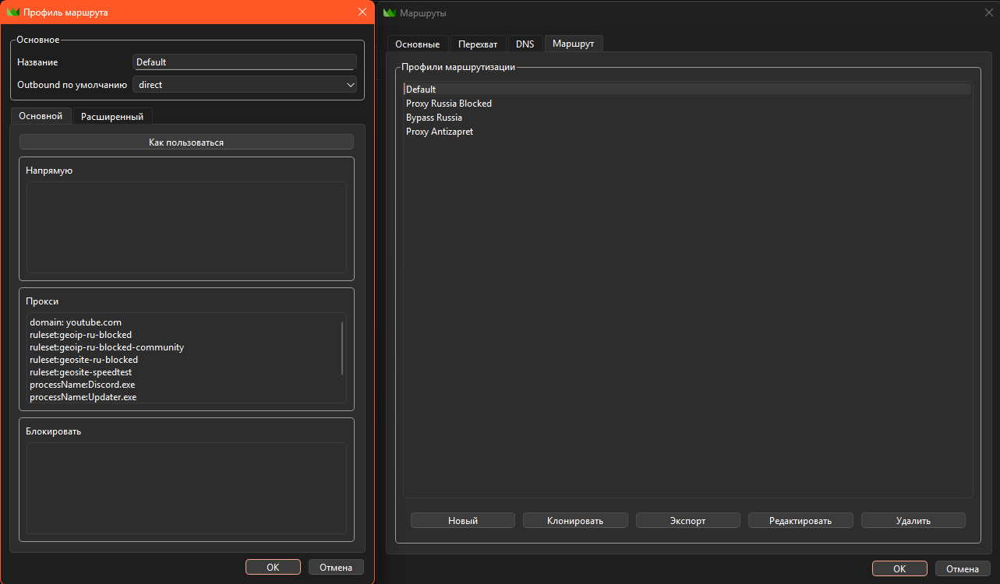

# Руководство по настройке правил в Throne

> Инструкция объясняет, как настроить маршрутизацию трафика (через прокси, напрямую или блокировку) в приложении **Throne**.

---

## 1. Основные понятия

В Throne есть два уровня управления трафиком:

1. **Outbound по умолчанию** – «резервный» маршрут.  
   Всё, что не попадает под явно прописанные правила, будет идти:
   * **direct** – напрямую в интернет;
   * **proxy** – через выбранный прокси;
   * **block** – блокироваться.

2. **Правила (Rules)** – приоритетные условия, которые срабатывают раньше, чем настройка по умолчанию.

---

## 2. Форматы правил

Каждая строка – это условие: *«Если трафик подходит, то выполнить действие (Proxy / Direct / Block)»*.

| Формат            | Что проверяет                              | Пример                           | Описание |
|--------------------|--------------------------------------------|------------------------------------|---------|
| **domain:**        | Полное совпадение домена                  | `domain:youtube.com`              | Только точный домен без поддоменов. |
| **suffix:**        | Окончание домена                           | `suffix:youtube.com`              | Все поддомены `*.youtube.com`. |
| **keyword:**       | Наличие ключевого слова в домене          | `keyword:yt`                      | Любой домен, где встречается `yt`. |
| **regex:**         | Совпадение по регулярному выражению        | `regex:^.*(yt|youtube)\.com$`     | Гибкая проверка (требуются знания RegExp). |
| **ruleset:**       | Готовый набор правил (список доменов/IP)   | `ruleset:geoip-ru-blocked`        | Подключает заранее подготовленный список. |
| **ip:**            | Диапазон IP-адресов (CIDR)                 | `ip:8.8.8.0/24`                   | Все адреса указанной подсети. |
| **processName:**   | Имя исполняемого файла                     | `processName:Discord.exe`         | Трафик конкретного приложения. |
| **processPath:**   | Полный путь к исполняемому файлу           | `processPath:C:\Games\Game.exe`   | То же, но учитывается полный путь.

---

## 3. Действия для правил

* **Proxy** – отправить трафик через выбранный прокси-сервер.
* **Direct** – обойти прокси, выйти в интернет напрямую.
* **Block** – заблокировать трафик.

⚠️ Правила обрабатываются **сверху вниз**: сработает первое подходящее.

---

## 4. Режимы подключения

| Режим          | Что делает | Когда использовать |
|-----------------|-----------|--------------------|
| **TUN**        | Создаёт виртуальный сетевой адаптер и перехватывает весь трафик системы (как VPN). | Когда нужно, чтобы **все** программы работали через правила. |
| **ПРОКСИ**     | Поднимает локальный HTTP/SOCKS-прокси, который можно указать вручную в приложениях или в системных настройках. | Когда нужно направить через прокси только выбранные программы или браузер. |
| **Системный DNS** | Перехватывает и обрабатывает только DNS-запросы. | Если хотите обходить блокировки на уровне DNS без полного VPN. |

---

## 5. Пример базовой конфигурации

### Настройки:
* **Outbound по умолчанию:** `direct`  
  – весь трафик, не подходящий под правила, идёт напрямую.

* **Прокси** (перечень правил для выхода через прокси):
domain: youtube.com
ruleset:geoip-ru-blocked
ruleset:geoip-ru-blocked-community
ruleset:geosite-ru-blocked
ruleset:geosite-speedtest
processName:Discord.exe
processName:Updater.exe

Эти сайты и процессы будут направлены через прокси-сервер.

* **Напрямую** – пока пусто, значит нет исключений для прямого выхода.
* **Блокировать** – пока пусто, значит ничего не блокируется.

---

## 6. Логика работы

1. Throne идёт по списку правил сверху вниз.  
2. На первом совпадении применяет действие (Proxy / Direct / Block).  
3. Если совпадений нет – применяется «Outbound по умолчанию».

---

## 7. Практические советы

* Если хотите, чтобы **всё** шло через прокси, а исключения задать вручную – установите `proxy` в «Outbound по умолчанию» и пропишите нужные сайты в «Напрямую».  
* Для тонкой фильтрации удобно использовать готовые **ruleset** – они обновляются автоматически.  
* Помните: изменение правил в «Advanced» теряется при сохранении, редактируйте только в основном окне.

---

